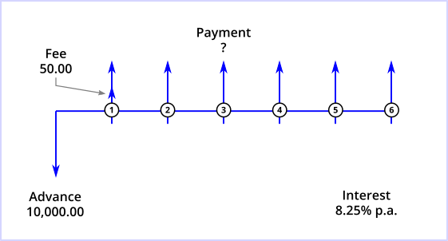
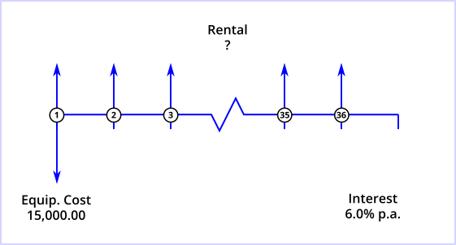
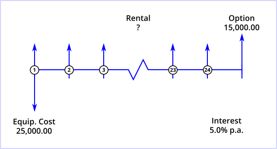
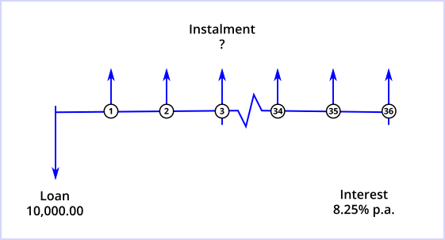
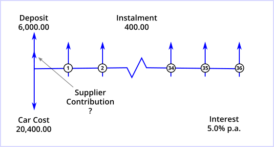
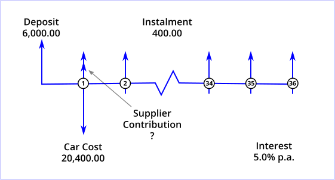
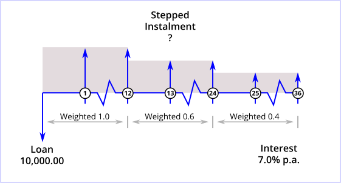
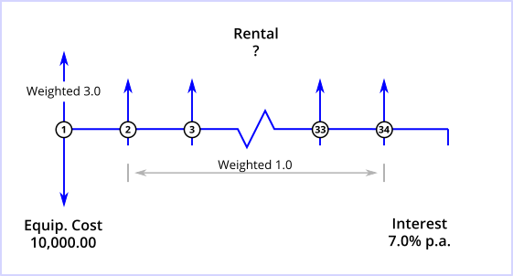

# Curo Calculator Demo


This application showcases certain features of the [Curo Calculator](https://www.npmjs.com/package/@curo/calculator) available for download from NPM.

If you are reading this document in GitHub and want to quickly evaluate the calculator then visit [Stackblitz](https://stackblitz.com/@andrewmurphy353) where you are able to interact with the various demos presented below.

Finally, if you haven't already done so please read the Curo Calculator [README](https://github.com/andrewmurphy353/curo-calculator) document for a quick and high level introduction to the calculator library.

## **DEMO 1:** Solve Unknown Payment, Compute Borrower's APR (Annual Percentage Rate)

## Problem Definition
An individual has applied for a loan of 10,000.00, repayable by 6 monthly instalments in arrears. A fee of 50.0 is payable with the first instalment. The lender's effective annual interest rate is 8.25%. This scenario is illustrated below. 



Using the US 30/360 day count convention, compute the value of the unknown instalments/payments and the borrower's APR.

## Code Solution
See src/demo01.ts
```ts
const calc = new Calculator();

// Define the cash flow series
calc.add(
  SeriesAdvance.builder()
    .setLabel("Loan advance")
    .setAmount(10000.0)
    .build()
);
calc.add(
  SeriesPayment.builder()
    .setNumberOf(6)
    .setLabel("Instalment")
    .setMode(Mode.Arrear)
    .build()
);
calc.add(
  SeriesCharge.builder()
    .setLabel("Fee")
    .setAmount(50.0)
    .setMode(Mode.Arrear)
    .build()
);

// Calculate the unknown payment
const pmtResult = calc.solveValue(new US30360(), 0.0825);

// Calculate the borrower's APR
const aprDecimal = calc.solveRate(new EU200848EC());
// Calculate the borrower's XIRR (see comment below)
const xirrDecimal = calc.solveRate(new US30360(undefined, true, true));
```

## Calculation Output
The results of this calculation are:
* Payment value of 1707.00
* APR of 10.4% (to 1 decimal place)

A quick word on the APR. In the demo it is computed in compliance with the European Union Consumer Credit Directive EU2008/49/EC. The directive requires the APR to reflect the total cost of credit, which in a nutshell requires all financing cash flows, plus any non-financing cash flows linked to the credit agreement such as charges and fees, to be included in the calculation. Nothing controversial here. But what if you are not in the European Union and want to achieve the same affect? In such cases you should compute the XIRR (eXtended Internal Rate of Return) implicit in the cash flow series. This will produce a result that is similar, if not exactly the same, and the single line of code showing you how is shown above (comment out `const aprDecimal = ...` in the demo).


## **DEMO 2:** Solve Unknown Rental, Compute Lessor's IRR (Internal Rate of Return)

## Problem Definition
A business enters into a 3-year finance lease for equipment costing 15,000.00. Rentals are due monthly in advance. The lessor's effective annual interest rate is 6.0%. This scenario is illustrated below. 



Using the Actual/Actual (ISDA) day count convention, compute the value of the unknown rentals and the lessor's IRR.

## Code Solution
See src/demo02.ts
```ts
const calc = new Calculator();

// Define the cash flow series
calc.add(
  SeriesAdvance.builder()
    .setLabel("Equipment purchase")
    .setAmount(15000.0)
    .build()
);
calc.add(
  SeriesPayment.builder()
    .setNumberOf(36)
    .setLabel("Rental")
    .setMode(Mode.Advance) // No need to define as this is the default
    .build()
);

// Calculate the unknown rentals
const pmtResult = calc.solveValue(new ActISDA(), 0.06);

// Calculate the lessor's IRR
const rateDecimal = calc.solveRate(new ActISDA());
```

## Calculation Output
The results of this calculation are:
* Rental value of 454.14
* IRR of 6.000% (to 3 decimal places)

## **DEMO 3:** Solve Unknown Rental, Compute Lessor's XIRR (eXtended Internal Rate of Return)

## Problem Definition
A business enters into a 2-year operating lease for equipment costing 25,000.00. Rentals are due monthly in advance followed by a 15,000.00 purchase option (future value). The lessor's effective annual interest rate is 5.0%. This scenario is illustrated below. 



Using the US 30/360 day count convention, compute the value of the unknown rentals and the lessor's XIRR.

## Code Solution
See src/demo03.ts
```ts
const calc = new Calculator();

// Define the cash flow series
calc.add(
  SeriesAdvance.builder()
    .setLabel("Equipment purchase")
    .setAmount(25000.0)
    .build()
);
calc.add(
  SeriesPayment.builder()
    .setNumberOf(24)
    .setLabel("Rental")
    .build()
);
calc.add(
  SeriesPayment.builder()
    .setNumberOf(1)
    .setLabel("Purchase option")
    .setAmount(15000.0)
    .build()
);

// Calculate the unknown rentals
const pmtResult = calc.solveValue(new US30360(), 0.05);

// Calculate the lessor's XIRR
const rateDecimal = calc.solveRate(new US30360(undefined, undefined, true));
```

## Calculation Output
The results of this calculation are:
* Rental value of 499.13
* XIRR of 5.116% (to 3 decimal places)

## **DEMO 4:** Solve Unknown Payment with Irregular Interest Compounding

## Problem Definition
An individual secures a loan of 10,000.00 repayable by 36 monthly instalments in arrears. The lender's effective annual interest rate is 8.25% and interest is compounded quarterly (not monthly). This scenario is illustrated below.



> Notice the absence of tick marks below payments 1, 2, 34 and 35? This signifies that interest is not capitalised, instead it continues to be accrued until the next compounding period with a tick mark is encounted i.e. every 3rd payment, or quarterly.

Now, using the US 30/360 day count convention compute the value of the unknown payments and the lender's IRR.

## Code Solution
See src/demo04.ts
```ts
const calc = new Calculator();
const today = new Date();

// Define the cash flow series
calc.add(
  SeriesAdvance.builder()
    .setLabel("Loan advance")
    .setAmount(10000.0)
    .setDrawdownFrom(today)
    .build()
);
calc.add(
  SeriesPayment.builder()
    .setNumberOf(36)
    .setLabel("Instalment")
    .setMode(Mode.Arrear)
    .setDueOnOrFrom(today)
    .setIsIntCap(false) // Important to override default true
    .build()
);
calc.add(
  SeriesPayment.builder()
    .setNumberOf(12)
    .setLabel("Interest")
    .setAmount(0.0) // Important to set pmt amount to zero
    .setMode(Mode.Arrear)
    .setFrequency(Frequency.Quarterly)
    .setDueOnOrFrom(today)
    .setIsIntCap(true)
    .build()
);

// Calculate the unknown payment
const pmtResult = calc.solveValue(new US30360(), 0.0825);

// Calculate the lender's IRR
const rateDecimal = calc.solveRate(new US30360());
```
> In this demo you are introduced to a powerful feature of the calculator, and that is you are permitted to define your own start dates for each series you define. This, as seen above, enables you to interweave two or more series to create a hybrid cash flow series with different property sets; and this is the approach used to solve this particular problem. First, define a monthly payment cash flow series and set `.setIsIntCap(false)` to override interest capitalisation in this series. Next, define a cash flow series for the quarterly interest accruals, assign a zero payment value, and set `.setIsIntCap(true)` to turn interest capitalisation on in this series (this is actually on by default). As you may expect given the same start dates, the date of each interest cash flow will coincide with the date of every third payment cash flow when both series are interwoven, and this is exactly what you will see when you review the amortisation schedule produced with the results.

## Calculation Output
The results of this calculation are:
* Rental value of 314.25
* IRR of 8.250% (to 3 decimal places)

> Tip: When you run this demo the amortisation schedule accompanying the results will show interest is compounded quarterly, not monthly.

## **DEMO 5:** Compute Supplier Contribution, 0% Interest Finance Promotion

## Problem Definition
A car dealership offers an individual 0% finance on a car costing 20,400.00. An upfront deposit of 6000.00 is payable, followed by 36 monthly instalments of 400.00 in arrears. Finance is provided by a third party lender at an effective annual interest rate of 5.0%. The supplier agrees with the lender to make an *undisclosed* contribution to cover the cost of finance. This scenario is illustrated below.



Using the US 30/360 day count convention, compute the value of the contribution and lender's IRR.

## Code Solution
See src/demo05.ts
```ts
const calc = new Calculator();
const today = new Date();

// Define the cash flow series
calc.add(
  SeriesAdvance.builder()
    .setLabel("Cost of car")
    .setAmount(20400.0)
    .setDrawdownFrom(today)
    .build()
);
calc.add(
  SeriesPayment.builder()
    .setNumberOf(1)
    .setLabel("Deposit")
    .setAmount(6000.0)
    .setDueOnOrFrom(today)
    .build()
);
calc.add(
  SeriesPayment.builder()
    .setNumberOf(1)
    .setLabel("Supplier contribution")
    .setDueOnOrFrom(today)
    .build()
);
calc.add(
  SeriesPayment.builder()
    .setNumberOf(36)
    .setLabel("Instalment")
    .setAmount(400.0)
    .setMode(Mode.Arrear)
    .setDueOnOrFrom(today)
    .build()
);

// Calculate the supplier contribution
const pmtResult = calc.solveValue(new US30360(), 0.05);

// Calculate the lender's IRR
const rateDecimal = calc.solveRate(new US30360());
```

## Calculation Output
The results of this calculation are:
* Supplier contribution of 1,053.72
* IRR of 5.000% (to 3 decimal places)

> We already know the effective interest rate to the borrower is 0% (the sum of the deposit and all payments equals the cost of the car), but what if we wanted to check it? In order to do so you would perform the above calculation again, but simply omit the supplier contribution cash flow series. In this case the result from the line `const rateDecimal = calc.solveRate(new US30360());` would return the interest rate implicit in the series from *the borrower's perspective*. Also bear in mind there would be no need to call `calc.solveValue(...)` as all the cash flow values are known.

## **DEMO 6:** Compute Supplier Contribution, 0% Interest Finance Promotion, 30 Day Deferred Settlement

## Problem Definition (a variation of demo 5)
A car dealership offers an individual 0% finance on a car costing 20,400.00. An upfront deposit of 6000.00 is payable, followed by 36 monthly instalments of 400.00 in arrears. Finance is provided by a third party lender at an effective annual interest rate of 5.0%. The supplier agrees with the lender to make an *undisclosed* contribution to cover the cost of finance, and furthermore offers the lender 30 day settlement terms. This scenario is illustrated below.



Using the US 30/360 day count convention, compute the value of the contribution and lender's IRR.

## Code Solution
See src/demo06.ts
```ts
const calc = new Calculator();
const today = new Date();

// Define the cash flow series
calc.add(
  SeriesAdvance.builder()
    .setLabel("Cost of car")
    .setAmount(20400.0)
    .setDrawdownFrom(today)
    .setSettlementOn(DateUtils.rollDay(today, 30)) // 30 days from today
    .build()
);
calc.add(
  SeriesPayment.builder()
    .setNumberOf(1)
    .setLabel("Deposit")
    .setAmount(6000.0)
    .setDueOnOrFrom(today)
    .build()
);
calc.add(
  SeriesPayment.builder()
    .setNumberOf(1)
    .setLabel("Supplier contribution")
    .setDueOnOrFrom(DateUtils.rollDay(today, 30)) // 30 days from today
    .build()
);
calc.add(
  SeriesPayment.builder()
    .setNumberOf(36)
    .setLabel("Instalment")
    .setAmount(400.0)
    .setMode(Mode.Arrear)
    .setDueOnOrFrom(today)
    .build()
);

// Calculate the supplier contribution
const pmtResult = calc.solveValue(new US30360(false), 0.05);

// Calculate the lender's IRR (based on cash flow value dates)
const rateDecimal = calc.solveRate(new US30360(false));
```
> When determining the lender's IRR *under deferred settlement schemes* it is important the calculation is based on the cash flow *value dates*. You specify the handling of this special case by passing `false` as the first argument to the day count convention constructor, as above. Finally, the demo 6 comment concerning the calculation of the borrower's implicit interest rate applies equally here.

## Calculation Output
The results of this calculation are:
* Supplier contribution of 999.97
* IRR of 5.000% (to 3 decimal places)

## **DEMO 7:** Solve Unknown Payment, Stepped Repayment Profile

## Problem Definition
An individual secures a loan of 10,000.00 repayable by 36 monthly instalments in arrears on a stepped profile. The instalments payable in each successive year are to be stepped at the ratio 1.0 : 0.6 : 0.4 to accelerate capital recovery in earlier years. The lender's effective annual interest rate is 7.0%. This scenario is illustrated below.



Using the US 30/360 day count convention, compute the value of the unknown (fully weighted) instalment and the borrower's APR.

## Code Solution
See src/demo07.ts
```ts
const calc = new Calculator();

// Define the cash flow series
calc.add(
  SeriesAdvance.builder()
    .setLabel("Loan advance")
    .setAmount(10000.0)
    .build()
);
calc.add(
  SeriesPayment.builder()
    .setNumberOf(12)
    .setLabel("Instalment")
    .setMode(Mode.Arrear)
    .setWeighting(1.0) // 100% of the unknown payment value (fully weighted)
    .build()
);
calc.add(
  SeriesPayment.builder()
    .setNumberOf(12)
    .setLabel("Instalment")
    .setMode(Mode.Arrear)
    .setWeighting(0.6) // 60% of the unknown payment value
    .build()
);
calc.add(
  SeriesPayment.builder()
    .setNumberOf(12)
    .setLabel("Instalment")
    .setMode(Mode.Arrear)
    .setWeighting(0.4) // 40% of the unknown payment value
    .build()
);

// Calculate the unknown payment (fully weighted)
const pmtResult = calc.solveValue(new US30360(), 0.07);

// Calculate the borrower's APR
const rateDecimal = calc.solveRate(new EU200848EC());
```

## Calculation Output
The results of this calculation are:
* Payment (fully weighted) 453.63
* APR of 7.2% (to 1 decimal place)


## **DEMO 8:** Solve Unknown Rental, Loaded First Rental

## Problem Definition
A business enters into a 3-year finance lease for equipment costing 10,000.00. Rentals are due monthly with the first 3 rentals due upfront, followed by the remaining 33 monthly rentals due in arrears. The lessor's effective annual interest rate is 7.0%. This scenario is illustrated below. 



Using the US 30/360 day count convention, compute the value of the unknown rental and the lessor's IRR.

## Code Solution
See src/demo08.ts
```ts
const calc = new Calculator();

// Define the cash flow series
calc.add(
  SeriesAdvance.builder()
    .setLabel("Equipment cost")
    .setAmount(10000.0)
    .build()
);
calc.add(
  SeriesPayment.builder()
    .setNumberOf(1)
    .setLabel("Initial rental")
    .setWeighting(3.0) // 3x the unknown fully weighted payment value
    .build()
);
calc.add(
  SeriesPayment.builder()
    .setNumberOf(33)
    .setLabel("Rental")
    .setMode(Mode.Arrear)
    .setWeighting(1.0) // 1x the unknown fully weighted payment value
    .build()
);

// Calculate the unknown rental (fully weighted)
  const pmtResult = calc.solveValue(new US30360(), 0.07);

// Calculate the lessor's IRR
const rateDecimal = calc.solveRate(new US30360());
```
## Calculation Output
The results of this calculation are:
* Rental of 305.19
* IRR of 7.000% (to 3 decimal places)

---

## Feedback

If you have any queries or suggestions for different demos please make contact via github.

## License

Copyright © 2019, [Andrew Murphy](https://github.com/andrewmurphy353).
Released under the [MIT License](LICENSE).